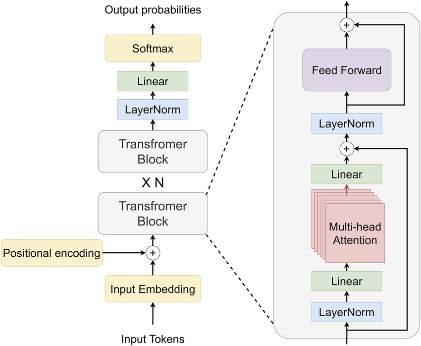

Long short term memory neural neworking model that predict next chords and music separators based on given seed

0.) Algorithm description

Long Short-Term Memory (LSTM) is a type of recurrent neural network (RNN) designed to model sequential data while solving the vanishing gradient problem.

Unlike standard RNNs, LSTM introduces a memory cell that preserves information over long sequences. The flow of information is controlled by three gates:

Forget gate – decides which information from the previous cell state should be removed.

Input gate – determines what new information should be stored in the cell state.

Output gate – controls what part of the cell state becomes the output.

At each time step:

The model receives the current input token and the previous hidden state.

The forget gate filters old memory.

The input gate updates the cell state with new candidate values.

The output gate produces the next hidden state.

A dense layer maps the hidden state to a probability distribution over the vocabulary.

For music generation, the model learns statistical dependencies between chord tokens and predicts the next chord in the sequence.

We may look at it on the photo


1. Dataset

The dataset used for training consists of 83 songs.
Although relatively small, the model is still able to generate reasonable and structurally consistent chord sequences.

The following structural separators were used:

<BAR> – separation of up to 4 chords within one bar (measure)

<BRIDGE> – section connecting different parts of the song

<CHORUS> – repeating section of the song

<INTRO> – introductory part

<OUTRO> – concluding section

<PRECHORUS> – section played before the chorus

<SONG> – separator between different songs in the dataset

Initially, the dataset was annotated manually. However, due to time constraints, an automatic section-detection script was implemented.

Since the source chord website did not provide structural separators, a heuristic algorithm (assisted by an LLM-generated approach) was used to infer and insert section tokens automatically.


The main idea:

Step 1: Bar Extraction

Chord tokens are grouped into bars using the <BAR> separator. Each bar is treated as a tuple of chords.

Step 2: Repeating Block Detection

The algorithm searches for repeating blocks of consecutive bars (length 4–8).
The most frequently repeated block is assumed to be the chorus.

A scoring function selects the best candidate:

score = occurrences × block_length

Step 3: Section Heuristics

Based on detected chorus positions:

INTRO – 2–4 bars before the first chorus

CHORUS – the detected repeating block

VERSE – longer unique sections between choruses

BRIDGE – short (<=4 bars) unique sections between choruses

OUTRO – last 2–4 bars of the song

If no repeating block is found, the structure defaults to:

INTRO (first bars)

VERSE (remaining bars)

Result

The final output is a token stream enriched with structural markers:

<INTRO> ... <CHORUS> ... <VERSE> ... <BRIDGE> ... <OUTRO>

This improves sequence modeling by giving the LSTM explicit structural context.

2. Model Training
Data Split

The dataset is split at the song level (not token level) to prevent data leakage:

80% – training set

10% – validation set

10% – test set

Each song is tokenized into chord and structural tokens. The vocabulary is loaded from vocab.json and built using training data only.

Unknown tokens are mapped to <UNK>, and sequences are padded with <PAD> when needed.

Sequence Construction

The model is trained using next-token prediction.

A sliding window of fixed length (SEQ_LEN = 24) is used:

Input: 24 previous tokens

Target: next token

This converts the token stream into (X, y) pairs for supervised learning.

Model Architecture

The network architecture is:

Embedding → LSTM → Dense (Softmax)

Embedding layer
Maps token IDs to dense vectors (EMB_DIM = 64)

LSTM layer
Learns sequential dependencies (LSTM_UNITS = 128)

Dense layer (Softmax)
Outputs probability distribution over the vocabulary

Loss function:

Sparse Categorical Crossentropy

Optimizer:

Adam (learning rate = 1e-3)

Regularization & Stability

To reduce overfitting on a small dataset (~83 songs):

EarlyStopping (patience = 3)

ReduceLROnPlateau

Fixed random seed for reproducibility

Evaluation

Model performance is evaluated on the test set using:

Accuracy

Cross-entropy loss

Perplexity (exp(loss))

Perplexity measures how well the model predicts the next token.

Generation

During generation:

The model predicts next-token probabilities.

Temperature sampling controls randomness.

Low temperature → conservative output

High temperature → more creative output

Repeated structural tokens are filtered.

The model generates chord sequences conditioned on an initial token sequence.


3. Output

One of the best generated sequences:

<SONG> <INTRO> Cm Gm <BAR> Dm C A# C <BAR> 
<CHORUS> A# C <BAR> A# A7 <BAR> 
<BRIDGE> Dm A# <BAR> A7 <BAR> C <BAR> F A7 <BAR> 
<BRIDGE> Dm A# <BAR> 
<OUTRO> A7 A <BAR> C <BAR> 
<CHORUS> A <BAR> Dm Gm <BAR> Dm A <BAR> 
<VERSE> Dm <BAR> Dm <BAR> 
<CHORUS> A# <BAR>

<SONG> <INTRO> Cm Gm

The model maintains structural consistency by preserving section markers and producing coherent chord transitions.
Despite the small dataset size, it captures basic harmonic patterns and repeating structures.

4. Future Improvements

Several improvements could significantly enhance the model:

Increase dataset size to several thousand songs

Improve automatic section detection and structural labeling

Introduce more advanced architectures (e.g., stacked LSTMs or Transformer-based models)

Add a graphical user interface (GUI)

Integrate audio playback to convert generated chord sequences into audible output

Currently, this is a small experimental project inspired by MIT 6.S191 (after the second lecture).
Some parts of the TensorFlow implementation were developed with LLM assistance, as the framework was new to me.

After taking CS231n I am eagre to give this project new life and redoo full dataset (increase size by 10 - 100x) and traine it using transformer architecture for language model. I hope this will give huge boost for quality of the model


Happy coding!

# 🎹 Piano Transformer

A GPT-style autoregressive Transformer for symbolic music generation, trained on 200 hours of piano performances from the MAESTRO dataset.


*Figure 1 — GPT-style Transformer Decoder Architecture*

---

## Overview

This project replaces a prior LSTM baseline with a Transformer decoder architecture, following the design principles of [minGPT](https://github.com/karpathy/minGPT) by Andrej Karpathy. The model learns to generate coherent piano music token-by-token in an autoregressive fashion, capturing long-range harmonic and rhythmic dependencies that sequential models struggle with.

---

## Dataset

**200 hours of piano MIDI** (MAESTRO v3.0.0)

Each note is encoded as a 4-dimensional token:

| Dimension | Description |
|-----------|-------------|
| `pitch` | MIDI note number (0–127) |
| `velocity` | Dynamic intensity (0–127) |
| `duration` | Note length |
| `position` | Onset time within bar |

This representation allows the model to learn rhythm, harmony, and dynamics simultaneously.

---

## Architecture

A **GPT-style autoregressive Transformer decoder** with causal self-attention — the model can only attend to past tokens, making it suitable for sequential generation.

**Key components:**
- Multi-head Flash Self-Attention with causal masking
- Positional embeddings for sequence order awareness
- Feed-forward sublayers with residual connections and layer normalisation
- Autoregressive token-by-token decoding at inference

---

## Model Scale

The initial 150M-parameter model severely overfit the dataset. Following the **10–20 tokens per parameter** rule of thumb, the model was scaled down to the target range.

| Parameter | Value |
|-----------|-------|
| Dataset | 200 hours of piano MIDI |
| Initial parameters | 150M *(deprecated — overfit)* |
| **Target parameters** | **10M – 20M** |
| Scaling rule | 10–20 tokens per parameter |
| Hardware | RTX 5090 |
| Architecture | GPT-style Transformer decoder |
| Attention | Multi-head Flash Self-Attention |

---

## Results

Compared to the LSTM baseline, the Transformer model produces noticeably more coherent output:

- More consistent long-range musical structure
- Richer harmonic progressions and chord variety
- Better rhythmic regularity and dynamic variation
- More realistic articulation and velocity contours

---

## Project Structure

```
.
├── data/               # Dataset preprocessing and tokenisation
├── model/              # Transformer model definition
├── train.py            # Training loop
├── generate.py         # Autoregressive inference
├── assets/
│   └── transformer_architecture.png
└── README.md
```

---

## Getting Started

```bash
# Install dependencies
pip install -r requirements.txt

# Preprocess dataset
python data/preprocess.py --dataset maestro-v3.0.0

# Train
python train.py --config configs/base.yaml

# Generate
python generate.py --checkpoint checkpoints/best.pt --length 512

#I have also added giant midi dataset which you can prepare by this:

python prepare_giant_midi.py --zip_file /path/to/giant_midi.zip --output_dir data/giant_midi

#There is also now a possibility to finetune the model on your own dataset:
python train_finetune.py #and you choose your dataset path and path for csv for the split

```

Output was reasonable but far from top tier music generation models. I hope that with more data and a larger model, the quality will improve significantly.

You can find example in generated_samples/ — the model captures basic harmonic patterns and rhythmic structures, but there is still room for improvement in terms of musicality and coherence.


---


## References

- Vaswani et al. — [Attention Is All You Need](https://arxiv.org/abs/1706.03762) (2017)
- Karpathy — [minGPT](https://github.com/karpathy/minGPT)
- Hawthorne et al. — [MAESTRO Dataset](https://magenta.tensorflow.org/datasets/maestro)
- Dao et al. — [FlashAttention](https://arxiv.org/abs/2205.14135) (2022)
